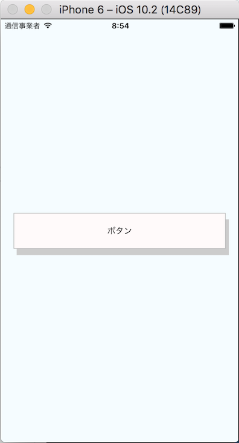
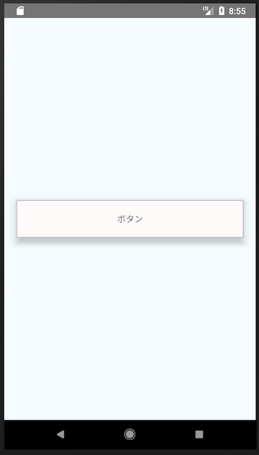

# ボタンに影をつける

## ios

- `shadowXxx`系の値で影をつけることができる

  ```js
    shadowColor: "#ccc",
    shadowOffset: {
      width: 5,
      height: 10
    },
    shadowRadius: 0,
    shadowOpacity: 1,
  ```



## android

- `elevation`で影をつけることができる
  - iosのように細かな制御はできないっぽい

```js
elevation: 10
```



- elevation
  - サポートはandroid5以上のみ
  - 4系は諦める
  - https://facebook.github.io/react-native/docs/view-style-props#elevation
